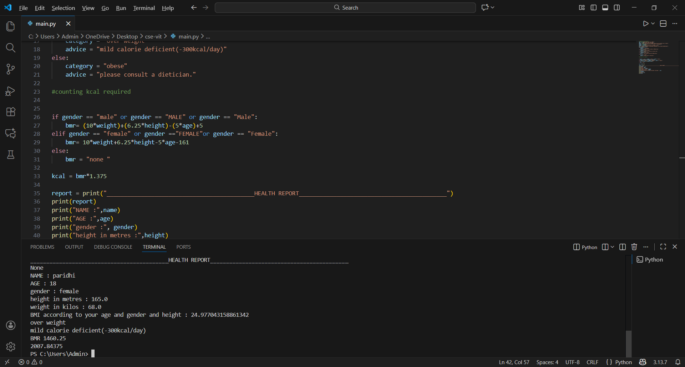

# cse-vit
#BMI AND DAILY CALORIE COUNTER 
This project is ideal for beginners learning python in their first semester.

A simple python program that calculates 
-Body mass index(BMI)
-BMI category(underweight,healthy,overweight,obese)
-Basel metabolic rate (BMR)
-Daily calorie counter (based on age,gender,and activity level)

FEATURES
-Takes user inputs: name, age, gender, weight, height
-Calculate BMI, BMR and KCAL per day using standard formulas. 
-Display a formatted health report

CONCEPTS USED
-variables
-input and output
-conditional statement
-basic health formulas
-arthemetic operations

FILES
main.py -> cointains the encoding logic and user input 

HOW TO RUN
1.Make sure Python is installed
2.Run this command in the terminal:python main.py
3.Enter the details
4.See the encoded result

SCREENSHOT OF THE OUTPUT

FLOWCHART

ALGORITHM
1.Start
2.Read name,age,gender,weight and height
3.Calculate BMI,BMR and KCAL using following formulas 
   BMI = weight(kg)/height**2(metres)
   BMR = 10*weight+6.25*height in cm-5*age-161(female)
         10*weight+6.25*height in cm-5*age-5   (male)
   KCAL= BMR*1.375

WHY I MADE THIS 
Just a simple project to understand variables,input and otputs,conditional statement and arthemetic operations in Python

